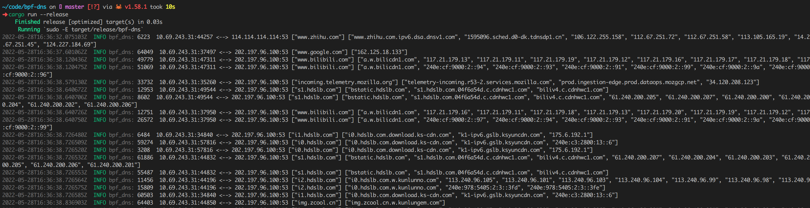

# 背景

本程序目前是 [基于eBPF的DNS Cache实现](https://www.gitlink.org.cn/glcc/subjects/detail/257) 的一个 demo。


# 运行

安装 Rust toolchain，参照 [redbpf](https://github.com/foniod/redbpf) 的安装教程安装所需程序，确保系统中的 `llvm` 版本号为 13。

安装完依赖，键入如下命令运行

```shell
$ cargo run --release
```


